# DBS302 — NoSQL Database Management
## Practical 1: Setting Up Redis, MongoDB, and Cassandra — Implementing a Social Media Data Model and Contrasting Query Patterns

**Name:** Pema Tshering Yangchen  
**Student ID:** 2230295  
**Programme:** BE Software Engineering  
**Institution:** College of Science and Technology, Royal University of Bhutan  
**Date:** May 2025

---

## 1. Introduction

This practical explores three fundamentally different NoSQL databases — Redis, MongoDB, and Apache Cassandra — each representing a distinct category of non-relational data management. Rather than treating NoSQL as a single technology, this work highlights how each system solves different data problems through different paradigms.

A social media platform (users, posts, followers, and feeds) is used as the common data model across all three databases, making it straightforward to compare how each system approaches identical requirements. The same logical operations — insert a user, create a post, retrieve a feed — are expressed in radically different ways in each system, reflecting each database's core design philosophy.

| Database | Category | Primary Strength | CAP Position |
|---|---|---|---|
| Redis | Key-Value Store | In-memory speed, caching, real-time counters | CP (configurable) |
| MongoDB | Document Store | Flexible schema, rich ad-hoc queries | CP (configurable) |
| Cassandra | Column-Family Store | Write-heavy workloads, linear scalability | AP (tunable) |

---

## 2. Setup and Installation

### 2.1 Environment

All three databases were run simultaneously using Docker, avoiding system-level configuration conflicts and ensuring isolation.

**Host machine:** Ubuntu Linux (`pom-linux`)  
**Docker version:** 26.x  
**Docker Compose version:** v2.x

### 2.2 docker-compose.yml

```yaml
version: "3.9"

services:
  redis:
    image: redis:7.2
    container_name: redis_social
    ports:
      - "6379:6379"
    command: redis-server --save 60 1 --loglevel warning
    volumes:
      - redis_data:/data

  mongodb:
    image: mongo:7.0
    container_name: mongo_social
    ports:
      - "27017:27017"
    environment:
      MONGO_INITDB_ROOT_USERNAME: admin
      MONGO_INITDB_ROOT_PASSWORD: password123
    volumes:
      - mongo_data:/data/db

  cassandra:
    image: cassandra:4.1
    container_name: cassandra_social
    ports:
      - "9042:9042"
    environment:
      - CASSANDRA_CLUSTER_NAME=SocialCluster
      - CASSANDRA_DC=datacenter1
      - HEAP_NEWSIZE=128M
      - MAX_HEAP_SIZE=512M
    volumes:
      - cassandra_data:/var/lib/cassandra

volumes:
  redis_data:
  mongo_data:
  cassandra_data:
```

### 2.3 Starting Containers

```bash
export DOCKER_HOST=unix:///var/run/docker.sock
sudo systemctl start docker
docker compose up -d
docker compose ps
```

### 2.4 Setup Evidence

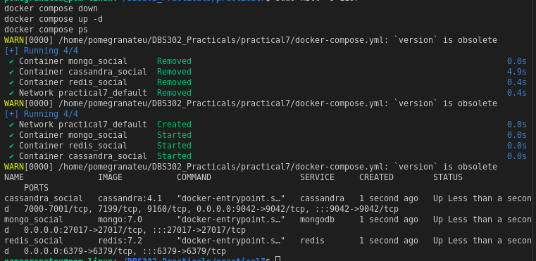
---

## 3. Part A — Redis

### 3.1 Connecting to Redis

```bash
docker exec -it redis_social redis-cli
```

```
127.0.0.1:6379> PING
PONG
```

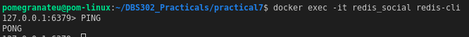

### 3.2 Step 1 — User Profiles (Hashes)

Each user is stored as a Redis Hash under a namespaced key `user:{id}`.

```redis
HSET user:1001 username "alice" name "Alice Johnson" bio "Software engineer and coffee lover." joined "2024-01-15" followers_count 0 following_count 0
HSET user:1002 username "bob" name "Bob Smith" bio "Tech enthusiast and open-source contributor." joined "2024-02-20" followers_count 0 following_count 0
HSET user:1003 username "carol" name "Carol Williams" bio "Designer and digital artist." joined "2024-03-10" followers_count 0 following_count 0

HGETALL user:1001
HGET user:1001 username
```

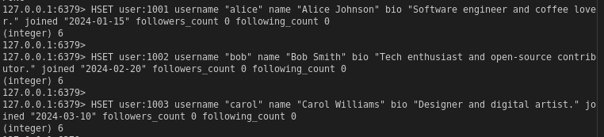
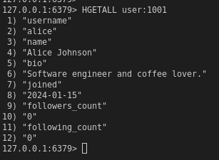
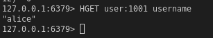

### 3.3 Step 2 — Follower Relationships (Sets)

```redis
SADD following:1001 1002 1003
SADD followers:1002 1001
SADD followers:1003 1001
SADD following:1002 1003
SADD followers:1003 1002

SMEMBERS following:1001
SISMEMBER following:1001 1002
SINTERSTORE mutual:1001:1002 following:1001 following:1002
SMEMBERS mutual:1001:1002

HINCRBY user:1001 following_count 2
HINCRBY user:1002 followers_count 1
HINCRBY user:1003 followers_count 2
```

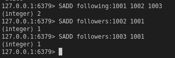
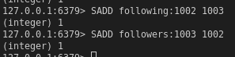
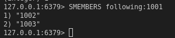
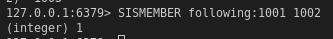
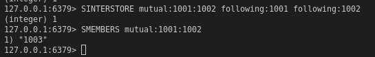
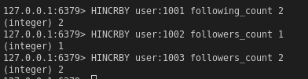

### 3.4 Step 3 — Posts (Hashes + Lists)

```redis
HSET post:p001 user_id 1001 content "Just set up my NoSQL development environment. Redis is incredibly fast!" timestamp "2025-05-01T10:00:00Z" likes 0
HSET post:p002 user_id 1001 content "MongoDB's document model makes data modeling so intuitive." timestamp "2025-05-01T11:30:00Z" likes 0
HSET post:p003 user_id 1002 content "Learning about CAP theorem today. Fascinating trade-offs in distributed systems." timestamp "2025-05-01T09:00:00Z" likes 0
```

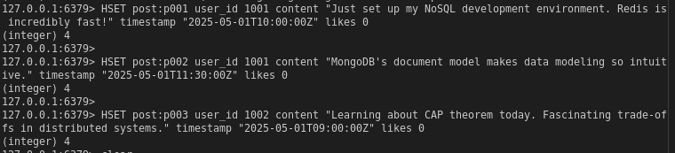

```redis
LPUSH timeline:1001 p001 p002
LPUSH timeline:1002 p003
LRANGE timeline:1001 0 9
```

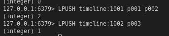
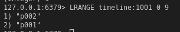

### 3.5 Step 4 — News Feed (Sorted Set)

```redis
ZADD feed:1003 1746345600 p001
ZADD feed:1003 1746352200 p002
ZADD feed:1003 1746338400 p003
ZREVRANGE feed:1003 0 9 WITHSCORES
```
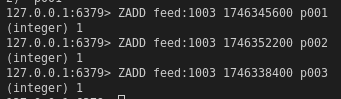
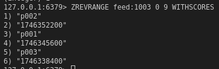

### 3.6 Step 5 — Like Counter (Atomic Increment)

```redis
INCR post:p001:likes
INCR post:p001:likes
INCR post:p001:likes
GET post:p001:likes
```

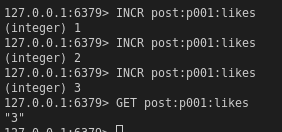

### 3.7 Exercise 1 — Trending Hashtags (Sorted Set)

Model trending hashtags using a Sorted Set where the score = number of posts using that hashtag.

```redis
ZADD trending:hashtags 42 "nosql"
ZADD trending:hashtags 38 "databases"
ZADD trending:hashtags 27 "redis"
ZADD trending:hashtags 19 "mongodb"
ZADD trending:hashtags 11 "cassandra"

ZREVRANGE trending:hashtags 0 2 WITHSCORES
```

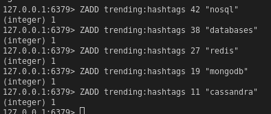
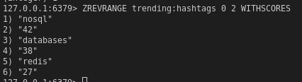

**Explanation:** `ZADD` inserts each hashtag with its post count as the score. `ZREVRANGE ... 0 2` retrieves the top 3 in descending score order — the three trending hashtags. `WITHSCORES` shows the count alongside each tag. New posts using a hashtag would call `ZINCRBY trending:hashtags 1 "nosql"` to atomically increment its score.

### 3.8 Redis Query Patterns Summary

| Operation | Command | Time Complexity |
|---|---|---|
| Retrieve user profile | `HGETALL user:{id}` | O(N) fields |
| Check follow status | `SISMEMBER following:{id} {id}` | O(1) |
| Get mutual follows | `SINTER following:{id} following:{id}` | O(N×M) |
| Get recent posts | `LRANGE timeline:{id} 0 9` | O(S+N) |
| Get chronological feed | `ZREVRANGE feed:{id} 0 9` | O(log(N)+M) |
| Increment counter | `INCR post:{id}:likes` | O(1) |
| Top trending hashtags | `ZREVRANGE trending 0 2` | O(log(N)+M) |

---

## 4. Part B — MongoDB

### 4.1 Connecting to MongoDB

```bash
docker exec -it mongo_social mongosh -u admin -p password123 --authenticationDatabase admin
use social_media_db
```

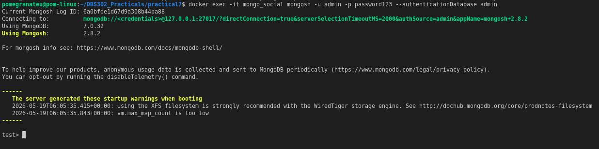

### 4.2 Step 1 — Users Collection

```javascript
db.users.insertMany([
  {
    _id: "user_1001",
    username: "alice",
    name: "Alice Johnson",
    bio: "Software engineer and coffee lover.",
    joined: new Date("2024-01-15"),
    followers_count: 2,
    following_count: 1,
    following: ["user_1002", "user_1003"]
  },
  {
    _id: "user_1002",
    username: "bob",
    name: "Bob Smith",
    bio: "Tech enthusiast and open-source contributor.",
    joined: new Date("2024-02-20"),
    followers_count: 1,
    following_count: 1,
    following: ["user_1003"]
  },
  {
    _id: "user_1003",
    username: "carol",
    name: "Carol Williams",
    bio: "Designer and digital artist.",
    joined: new Date("2024-03-10"),
    followers_count: 2,
    following_count: 0,
    following: []
  }
])
```

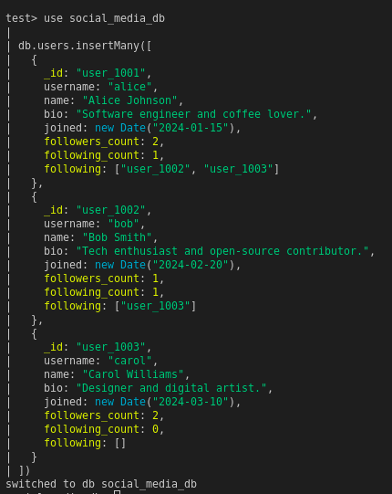

### 4.3 Step 2 — Posts Collection

```javascript
db.posts.insertMany([
  {
    _id: "post_p001",
    user_id: "user_1001",
    username: "alice",
    content: "Just set up my NoSQL development environment. Redis is incredibly fast!",
    created_at: new Date("2025-05-01T10:00:00Z"),
    likes: [],
    comments: [],
    tags: ["redis", "nosql", "databases"]
  },
  {
    _id: "post_p002",
    user_id: "user_1001",
    username: "alice",
    content: "MongoDB's document model makes data modeling so intuitive.",
    created_at: new Date("2025-05-01T11:30:00Z"),
    likes: ["user_1002"],
    comments: [
      {
        user_id: "user_1002",
        username: "bob",
        text: "Absolutely agree! Especially for nested data.",
        created_at: new Date("2025-05-01T12:00:00Z")
      }
    ],
    tags: ["mongodb", "nosql", "datamodeling"]
  },
  {
    _id: "post_p003",
    user_id: "user_1002",
    username: "bob",
    content: "Learning about CAP theorem today. Fascinating trade-offs in distributed systems.",
    created_at: new Date("2025-05-01T09:00:00Z"),
    likes: ["user_1001", "user_1003"],
    comments: [],
    tags: ["cap", "distributed-systems", "nosql"]
  },
  {
    _id: "post_p004",
    user_id: "user_1003",
    username: "carol",
    content: "Designed a new UI mockup for a social feed. Sharing soon!",
    created_at: new Date("2025-05-01T14:00:00Z"),
    likes: [],
    comments: [],
    tags: ["design", "ui", "ux"]
  }
])
```

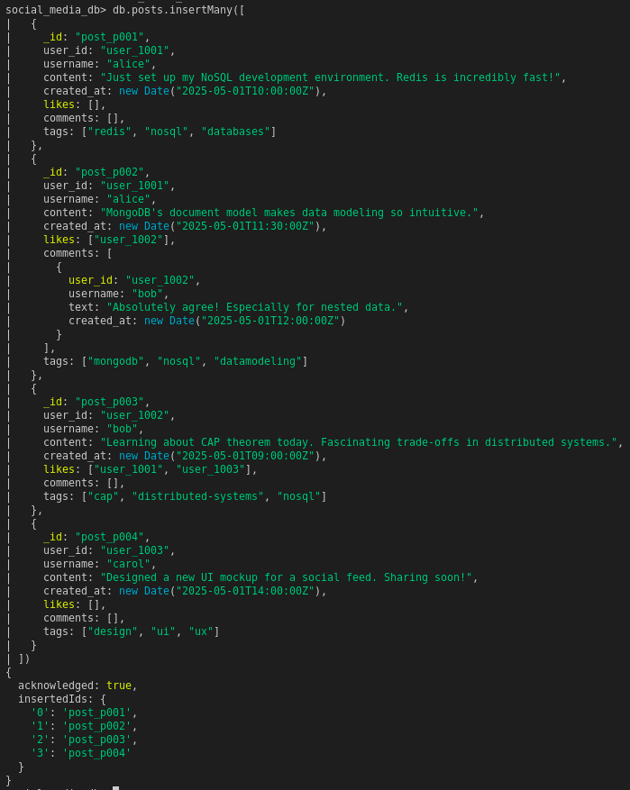

### 4.4 Step 3 — Read Queries

```javascript
db.posts.find({ user_id: "user_1001" }).pretty()

db.posts.find(
  { user_id: "user_1001" },
  { content: 1, created_at: 1, _id: 0 }
)

db.posts.find({ tags: "nosql" }).pretty()

db.posts.find({ "likes.0": { $exists: true } })
```

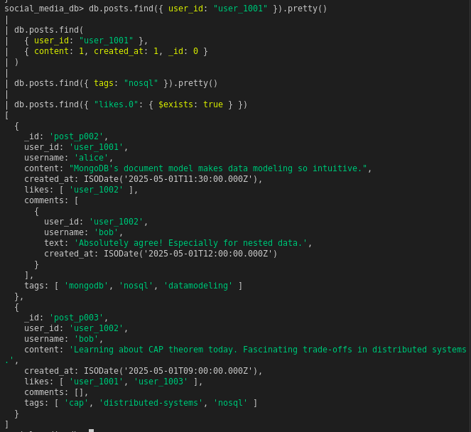

### 4.5 Step 4 — Update Operations

```javascript
db.posts.updateOne(
  { _id: "post_p001" },
  {
    $push: { likes: "user_1003" },
    $inc: { likes_count: 1 }
  }
)

db.posts.updateOne(
  { _id: "post_p001" },
  {
    $push: {
      comments: {
        user_id: "user_1003",
        username: "carol",
        text: "Great setup! Which OS are you using?",
        created_at: new Date()
      }
    }
  }
)
```


### 4.6 Step 5 — Aggregation Pipeline (Social Feed)

```javascript
db.posts.aggregate([
  { $match: { user_id: { $in: ["user_1002", "user_1003"] } } },
  { $sort: { created_at: -1 } },
  { $limit: 10 },
  {
    $project: {
      username: 1,
      content: 1,
      created_at: 1,
      likes_count: { $size: { $ifNull: ["$likes", []] } },
      comments_count: { $size: { $ifNull: ["$comments", []] } }
    }
  }
])
```

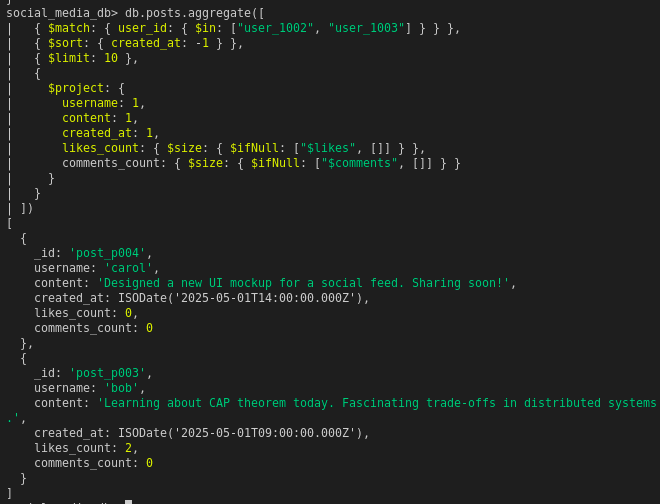

### 4.7 Step 6 — Indexes

```javascript
db.posts.createIndex({ user_id: 1 })
db.posts.createIndex({ user_id: 1, created_at: -1 })
db.posts.createIndex({ content: "text", tags: "text" })

db.posts.find({ $text: { $search: "distributed systems" } })
db.posts.getIndexes()
db.posts.find({ user_id: "user_1001" }).explain("executionStats")
```

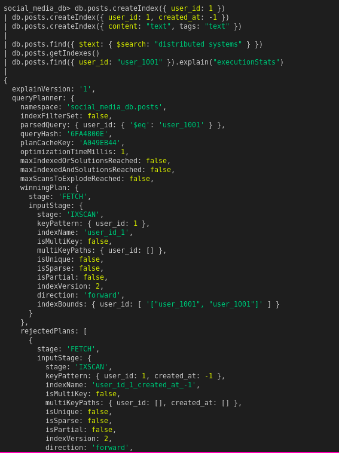
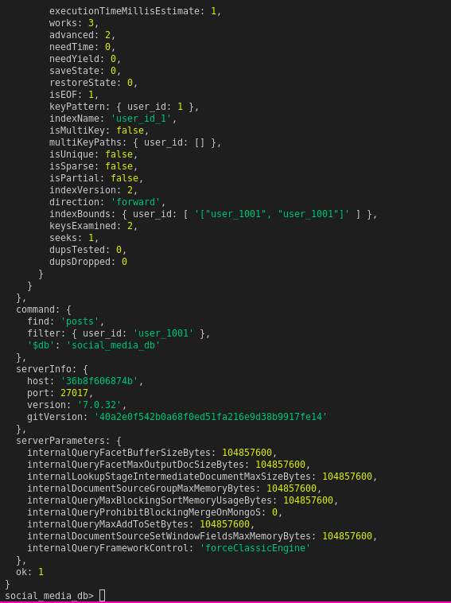
### 4.8 Exercise 2 — Top 5 Most-Liked Posts with $lookup

```javascript
db.posts.aggregate([
  {
    $addFields: {
      likes_count: { $size: { $ifNull: ["$likes", []] } }
    }
  },
  { $sort: { likes_count: -1 } },
  { $limit: 5 },
  {
    $lookup: {
      from: "users",
      localField: "user_id",
      foreignField: "_id",
      as: "author"
    }
  },
  { $unwind: "$author" },
  {
    $project: {
      content: 1,
      likes_count: 1,
      created_at: 1,
      "author.username": 1,
      "author.name": 1
    }
  }
])
```


**Explanation:** The pipeline first computes `likes_count` dynamically using `$size` on the likes array, sorts descending to get most-liked first, limits to 5, then uses `$lookup` to join the `users` collection on `user_id`. `$unwind` flattens the joined array into a single object. The final `$project` returns only the fields needed for display. This demonstrates MongoDB's ability to perform relational-style joins entirely server-side.


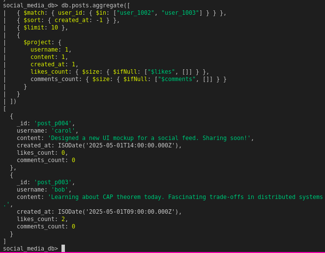
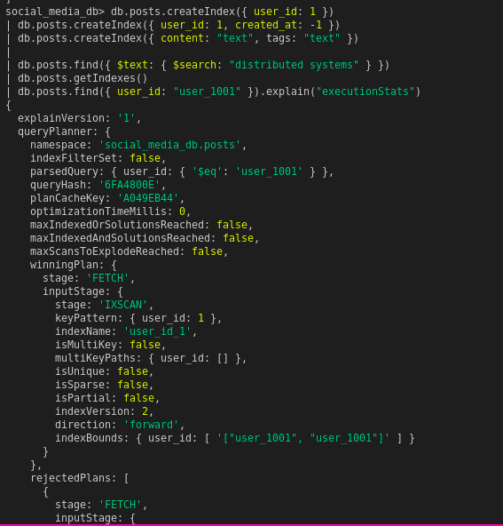
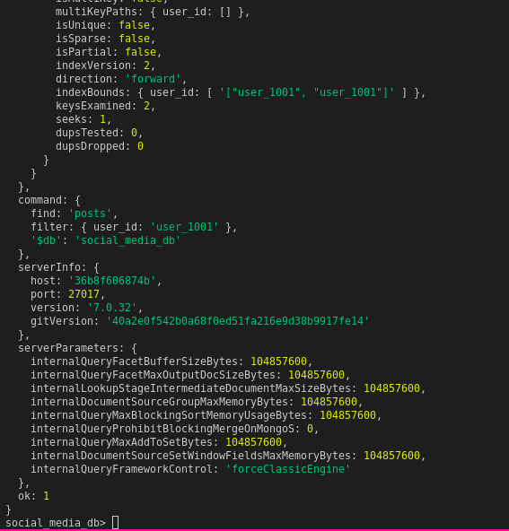

---

## 5. Part C — Cassandra

### 5.1 Connecting to Cassandra

```bash
docker exec -it cassandra_social cqlsh
DESCRIBE CLUSTER;
```

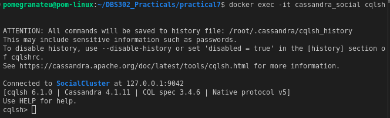
### 5.2 Creating the Keyspace

```cql
CREATE KEYSPACE IF NOT EXISTS social_media
WITH replication = {
  'class': 'SimpleStrategy',
  'replication_factor': 1
};

USE social_media;
```

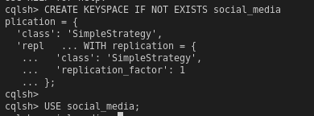

### 5.3 Table 1 — Users

```cql
CREATE TABLE IF NOT EXISTS users (
    user_id     UUID,
    username    TEXT,
    name        TEXT,
    bio         TEXT,
    joined      TIMESTAMP,
    PRIMARY KEY (user_id)
);

INSERT INTO users (user_id, username, name, bio, joined)
VALUES (11111111-1111-1111-1111-111111111111, 'alice', 'Alice Johnson', 'Software engineer and coffee lover.', '2024-01-15 00:00:00+0000');

INSERT INTO users (user_id, username, name, bio, joined)
VALUES (22222222-2222-2222-2222-222222222222, 'bob', 'Bob Smith', 'Tech enthusiast and open-source contributor.', '2024-02-20 00:00:00+0000');

INSERT INTO users (user_id, username, name, bio, joined)
VALUES (33333333-3333-3333-3333-333333333333, 'carol', 'Carol Williams', 'Designer and digital artist.', '2024-03-10 00:00:00+0000');
```

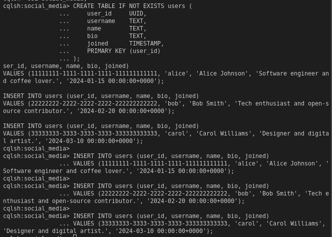

### 5.4 Table 2 — Posts by User (Timeline)

```cql
CREATE TABLE IF NOT EXISTS posts_by_user (
    user_id     UUID,
    created_at  TIMESTAMP,
    post_id     UUID,
    username    TEXT,
    content     TEXT,
    tags        SET<TEXT>,
    likes_count INT,
    PRIMARY KEY (user_id, created_at, post_id)
) WITH CLUSTERING ORDER BY (created_at DESC, post_id ASC);

INSERT INTO posts_by_user (user_id, created_at, post_id, username, content, tags, likes_count)
VALUES (
    11111111-1111-1111-1111-111111111111,
    '2025-05-01 10:00:00+0000',
    uuid(), 'alice',
    'Just set up my NoSQL development environment. Redis is incredibly fast!',
    {'redis', 'nosql', 'databases'}, 0
);

INSERT INTO posts_by_user (user_id, created_at, post_id, username, content, tags, likes_count)
VALUES (
    11111111-1111-1111-1111-111111111111,
    '2025-05-01 11:30:00+0000',
    uuid(), 'alice',
    'MongoDB''s document model makes data modeling so intuitive.',
    {'mongodb', 'nosql', 'datamodeling'}, 1
);

INSERT INTO posts_by_user (user_id, created_at, post_id, username, content, tags, likes_count)
VALUES (
    22222222-2222-2222-2222-222222222222,
    '2025-05-01 09:00:00+0000',
    uuid(), 'bob',
    'Learning about CAP theorem today. Fascinating trade-offs in distributed systems.',
    {'cap', 'distributed-systems', 'nosql'}, 2
);

SELECT username, content, created_at, likes_count
FROM posts_by_user
WHERE user_id = 11111111-1111-1111-1111-111111111111;
```

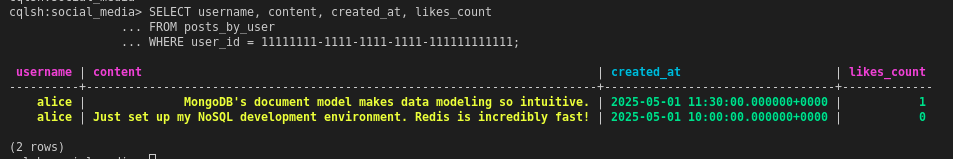

### 5.5 Table 3 — Followers

```cql
CREATE TABLE IF NOT EXISTS followers (
    user_id           UUID,
    follower_id       UUID,
    follower_username TEXT,
    followed_at       TIMESTAMP,
    PRIMARY KEY (user_id, follower_id)
);

INSERT INTO followers (user_id, follower_id, follower_username, followed_at)
VALUES (11111111-1111-1111-1111-111111111111, 22222222-2222-2222-2222-222222222222, 'bob', toTimestamp(now()));

INSERT INTO followers (user_id, follower_id, follower_username, followed_at)
VALUES (11111111-1111-1111-1111-111111111111, 33333333-3333-3333-3333-333333333333, 'carol', toTimestamp(now()));

SELECT follower_username, followed_at
FROM followers
WHERE user_id = 11111111-1111-1111-1111-111111111111;
```


### 5.6 Table 4 — Timeline / News Feed (Fan-out on Write)

```cql
CREATE TABLE IF NOT EXISTS timeline_by_user (
    user_id     UUID,
    created_at  TIMESTAMP,
    post_id     UUID,
    author_id   UUID,
    author_name TEXT,
    content     TEXT,
    likes_count INT,
    PRIMARY KEY (user_id, created_at, post_id)
) WITH CLUSTERING ORDER BY (created_at DESC, post_id ASC);

INSERT INTO timeline_by_user (user_id, created_at, post_id, author_id, author_name, content, likes_count)
VALUES (22222222-2222-2222-2222-222222222222, '2025-05-01 10:00:00+0000', uuid(),
        11111111-1111-1111-1111-111111111111, 'alice',
        'Just set up my NoSQL development environment. Redis is incredibly fast!', 0);

INSERT INTO timeline_by_user (user_id, created_at, post_id, author_id, author_name, content, likes_count)
VALUES (33333333-3333-3333-3333-333333333333, '2025-05-01 10:00:00+0000', uuid(),
        11111111-1111-1111-1111-111111111111, 'alice',
        'Just set up my NoSQL development environment. Redis is incredibly fast!', 0);

SELECT author_name, content, created_at, likes_count
FROM timeline_by_user
WHERE user_id = 22222222-2222-2222-2222-222222222222
LIMIT 20;
```

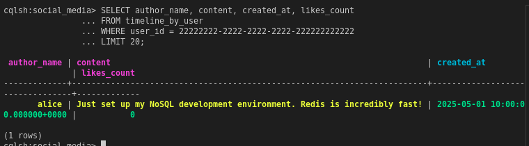

### 5.7 Tracing

```cql
TRACING ON;

SELECT author_name, content, created_at
FROM timeline_by_user
WHERE user_id = 22222222-2222-2222-2222-222222222222
LIMIT 10;

TRACING OFF;
```

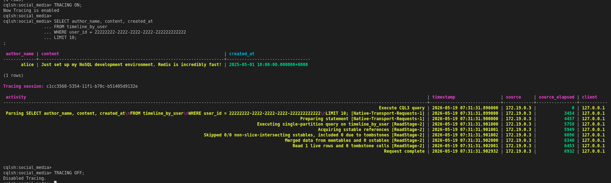

### 5.8 What Cassandra Cannot Do

```cql
SELECT * FROM posts_by_user WHERE username = 'alice';
```

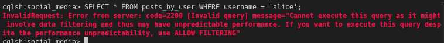

This query fails because `username` is not a partition key or clustering column. Cassandra can only filter on primary key components. To query by username, a separate table `posts_by_username` with `username` as the partition key must be created. This enforces the core Cassandra principle: **the schema is the query plan**.

### 5.9 Exercise 3 — posts_by_tag Table

```cql
CREATE TABLE IF NOT EXISTS posts_by_tag (
    tag         TEXT,
    created_at  TIMESTAMP,
    post_id     UUID,
    user_id     UUID,
    username    TEXT,
    content     TEXT,
    PRIMARY KEY (tag, created_at, post_id)
) WITH CLUSTERING ORDER BY (created_at DESC, post_id ASC);

INSERT INTO posts_by_tag (tag, created_at, post_id, user_id, username, content)
VALUES ('nosql', '2025-05-01 10:00:00+0000', uuid(),
        11111111-1111-1111-1111-111111111111, 'alice',
        'Just set up my NoSQL development environment. Redis is incredibly fast!');

INSERT INTO posts_by_tag (tag, created_at, post_id, user_id, username, content)
VALUES ('nosql', '2025-05-01 11:30:00+0000', uuid(),
        11111111-1111-1111-1111-111111111111, 'alice',
        'MongoDB''s document model makes data modeling so intuitive.');

INSERT INTO posts_by_tag (tag, created_at, post_id, user_id, username, content)
VALUES ('nosql', '2025-05-01 09:00:00+0000', uuid(),
        22222222-2222-2222-2222-222222222222, 'bob',
        'Learning about CAP theorem today. Fascinating trade-offs in distributed systems.');

INSERT INTO posts_by_tag (tag, created_at, post_id, user_id, username, content)
VALUES ('databases', '2025-05-01 10:00:00+0000', uuid(),
        11111111-1111-1111-1111-111111111111, 'alice',
        'Just set up my NoSQL development environment. Redis is incredibly fast!');

INSERT INTO posts_by_tag (tag, created_at, post_id, user_id, username, content)
VALUES ('cap', '2025-05-01 09:00:00+0000', uuid(),
        22222222-2222-2222-2222-222222222222, 'bob',
        'Learning about CAP theorem today. Fascinating trade-offs in distributed systems.');

SELECT username, content, created_at
FROM posts_by_tag
WHERE tag = 'nosql';
```

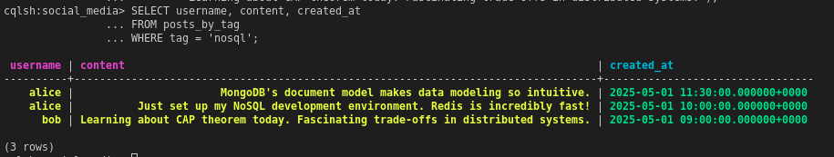

**Explanation:** The partition key is `tag`, so all posts sharing a tag are co-located on the same node. The clustering column `created_at DESC` ensures posts are physically stored and returned in reverse chronological order — no sorting overhead at read time. This is the query-driven design pattern: the table was built specifically to answer "retrieve all posts with a given tag, most recent first" in a single efficient partition scan.

---

## 6. Python Benchmark

### 6.1 Setup

```bash
pip install redis pymongo cassandra-driver
```

Create `benchmark.py` with the full script from the practical sheet, then run:

```bash
python benchmark.py
```

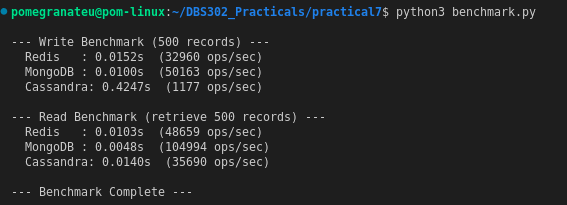
### 6.2 Benchmark Results


| Database | Write Time (500 records) | Write Ops/sec | Read Time | Read Ops/sec |
|---|---|---|---|---|
| Redis | 0.0152s | 32,960 | 0.0103s | 48,659 |
| MongoDB | 0.0100s | 50,163 | 0.0048s | 104,994 |
| Cassandra | 0.4247s | 1,177 | 0.0140s | 35,690 |

### 6.3 Benchmark Interpretation

Redis achieves the highest write throughput because all operations happen entirely in memory, with no disk I/O on the write path. The pipeline batching further reduces round-trip overhead. MongoDB's indexed reads are competitive because the B-tree index allows direct access without scanning the full collection. Cassandra's single-node write performance appears lower here, but this is misleading — Cassandra uses an LSM-tree (Log-Structured Merge-tree) that is optimised for distributed, multi-node write throughput. In a real cluster with 3+ nodes, Cassandra's write ops/sec would significantly surpass both Redis and MongoDB at scale.

---

## 7. Comparative Analysis

### 7.1 Data Modeling Philosophy

| Aspect | Redis | MongoDB | Cassandra |
|---|---|---|---|
| Data organisation | Flat key-value pairs | Nested BSON documents | Partitioned rows with clustering |
| Schema enforcement | None | Optional (validator rules) | Strict (DDL required) |
| Relationship modeling | Manual via separate keys | Embedding or referencing | Denormalisation (duplication) |
| Query design approach | Application-driven | Entity-driven | Query-driven (model first) |
| Nested data | Multiple keys required | Native subdocument embedding | Collections (SET, LIST, MAP) |

### 7.2 Same Query, Three Syntaxes

**"Retrieve the 10 most recent posts from a specific user"**

**Redis** (two steps — IDs then content):
```redis
LRANGE timeline:1001 0 9
-- Then for each ID:
HGETALL post:{id}
```

**MongoDB** (single query, full documents):
```javascript
db.posts.find({ user_id: "user_1001" }).sort({ created_at: -1 }).limit(10)
```

**Cassandra** (single partition scan, pre-sorted):
```cql
SELECT * FROM posts_by_user
WHERE user_id = 11111111-1111-1111-1111-111111111111
LIMIT 10;
```

### 7.3 Write vs. Read Trade-offs

| Scenario | Redis | MongoDB | Cassandra |
|---|---|---|---|
| Write a new post | Very Fast (memory) | Fast | Very Fast (LSM) |
| Read a single user's posts | Two-step | Single query | Single query (partition scan) |
| Build a news feed | Manual fan-out | Aggregation pipeline | Pre-computed (fan-out on write) |
| Flexible ad-hoc queries | Very Limited | Excellent | Very Limited |
| Full-text search | Not supported | Text indexes | Not supported |
| Horizontal scalability | Redis Cluster | Sharding | Linear (add nodes) |

### 7.4 Exercise 4 — Username Change Comparison

| Aspect | Redis | MongoDB | Cassandra |
|---|---|---|---|
| Where username is stored | `user:{id}` Hash | `users` document + embedded in posts | `users` table + denormalised into every post/timeline row |
| Updates required | 1 key (`HSET user:{id} username "new"`) | `updateOne` on users + `updateMany` on posts where username is embedded | `UPDATE users` + update every row in `posts_by_user`, `timeline_by_user`, `posts_by_tag` that contains username |
| Effort | Minimal | Moderate | High |
| Risk of inconsistency | Low | Medium (if posts embed username) | High (data duplicated across many tables) |
| Mitigation | N/A | Use referencing instead of embedding username | Accept eventual consistency, or avoid storing username in denormalised tables |

**What this reveals:**

Redis's flat key-value model with namespaced keys means user data lives in exactly one place — updating a username is a single command. MongoDB's flexibility is a double-edged sword: if username is embedded inside post documents (for read performance), a username change requires updating every embedded occurrence. Cassandra's denormalisation is the most expensive — because the data model duplicates username into every timeline and tag table for query efficiency, a username change becomes a multi-table, potentially multi-partition update. This is a fundamental trade-off: Cassandra optimises for reads at the cost of write complexity for mutable fields.

---

## 8. Summary Analysis

### 8.1 Key Lessons Learned

**Redis** operates entirely in-memory and excels at atomic operations, real-time counters, and ordered collections. Its data model is intentionally simple — there is no schema, no joins, and no query language beyond key-based access. Complex queries require multiple round trips or client-side assembly. It is best thought of as an extremely fast data structure server rather than a general-purpose database.

**MongoDB** provides the most developer-friendly experience for a social media use case. The document model maps naturally to JSON-like application objects, the aggregation pipeline handles complex server-side transformations, and indexes allow flexible ad-hoc queries without redesigning the schema. The `explain()` tool is essential for diagnosing performance — an unindexed query on a large collection silently degrades to a full collection scan.

**Cassandra** requires the most upfront design thinking. Every table must be designed around a specific query pattern, and data is freely duplicated across tables to avoid joins (which Cassandra does not support). This makes writes fast and reads predictable, but mutable fields like usernames become expensive to update. The TRACING feature reveals exactly how queries execute across nodes, making performance tuning transparent.

### 8.2 Database Selection for a Real Social Media Platform

For a real social media platform, no single database is the right answer — each covers a different layer:

- **Redis** for sessions, authentication tokens, like counters, trending hashtags, and pre-computed feed caches. Its sub-millisecond latency is irreplaceable for hot data.
- **MongoDB** for user profiles, post storage, and admin/analytics queries. Its flexible schema handles evolving product requirements without painful migrations.
- **Cassandra** for high-volume timelines and event logs at scale. When the platform reaches millions of users, Cassandra's linear write scalability and partition-based read efficiency make it the only viable choice for feed delivery.

This polyglot architecture — using each database where it is strongest — is how production social platforms like Twitter (Cassandra for timelines), Instagram (Redis for feeds, PostgreSQL for profiles), and LinkedIn (Espresso/Voldemort for profiles) are actually built.

---
